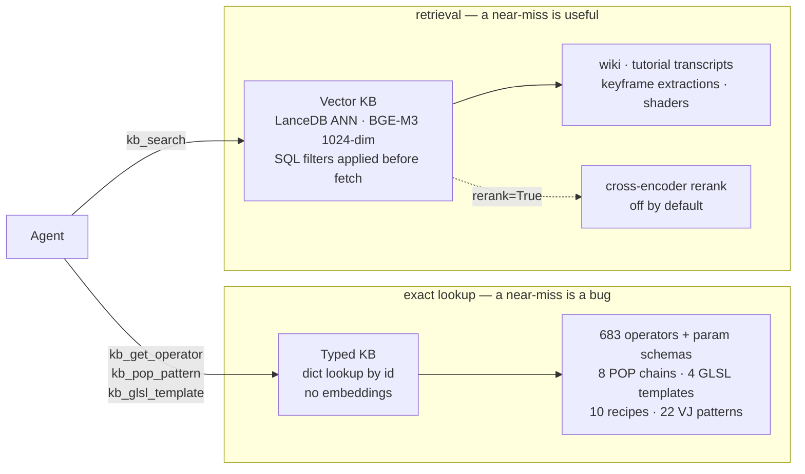

# td-mcp

**Claude builds TouchDesigner networks inside your running TD instance.**

A live bridge into TD, a typed knowledge base of what TD actually is (683 operators with full param schemas), and a visual feedback loop — so the agent works from the real build instead of what a model half-remembers.

Needs TouchDesigner 2025+ and Python 3.11+. Setup is 5 commands, about 5 minutes.

---

## 1. Install

```bash
git clone https://github.com/sashabedard/td-mcp.git && cd td-mcp
python3.11 -m venv .venv && source .venv/bin/activate
pip install -e ".[dev]"
claude mcp add td-mcp -- "$PWD/.venv/bin/td-mcp"
python scripts/install_skills.py
```

Use the **absolute** path, not a bare `td-mcp`. The MCP client starts the server from its own environment, not from your activated shell.

## 2. Wire up TouchDesigner

Drag `td_bridge_tox/td_mcp_bridge.tox` into `/project1/`. That's it — it listens on port 9988.

## 3. Check it works

Ask your agent:

> Call ping, then connect to TouchDesigner and tell me what's in the project.

`ping` answers with TD closed. `td_connect` needs TD open with the `.tox` loaded.

## 4. First real prompt

> Build me an audio-reactive particle system with POPs, then show me a snapshot.

The agent plans against the operator catalog, builds, screenshots, and fixes what doesn't cook — instead of handing you code to paste.

---

## Want semantic search too?

The base install gives you the bridge and the typed KB. Search over tutorials, wiki and shaders needs one more extra:

```bash
pip install -e ".[dev,kb]"     # + ~3GB torch; first search downloads BGE-M3
```

Without it, `kb_search` fails on a missing `sentence_transformers`. Everything else works fine.

---

## What you can ask for

- **Build a POP system from a prompt** — 8 vetted chains (particle feedback sim, `rayPOP` collisions, noise-displaced grids and spheres, point-cloud starter, CHOP→POP and TOP→POP bridges). The agent starts from a network that cooks.
- **Reproduce a look** — build → snapshot → measure the difference against your reference (luminance/contrast/RGB deltas always; CLIP similarity if you add `.[vj]`) → adjust. The loop ends when the image agrees, not when the explanation sounds good.
- **Cinematic post chains** — 10 recipes with operator chain, param values and pitfalls: shallow DOF, rack focus, lumablur bloom, anamorphic flare, filmic grade, god rays, motion blur, chromatic aberration, film grain.
- **Audio-reactive VJ loops** — 22 patterns tagged by BPM range, energy, palette and key operators.
- **GLSL TOPs** — 4 vetted templates (procedural, 1-input, 2-input, compute) with the uniform reference and TD-specific antipatterns.
- **Read and repair an existing project** — find what's eating the frame budget, then make an inherited spaghetti network readable.

## Why skills, not just tools

`scripts/install_skills.py` copies three protocol skills into `~/.claude/skills/`. Tools alone aren't enough: an agent left to itself still names operators from stale training data and calls a build done without looking at it. The skills make grounding, visual validation and cleanup mandatory.

They matter most for **POPs** — released in TD 2025, effectively absent from every model's training data. Reasoning by analogy from SOPs produces confident nonsense; a typed catalog and vetted chains replace the analogy.

Each skill is a plain Markdown file in `skills/`. Readable, editable, diffable if you want to change how the agent behaves.

## Why the KB is built this way



Ask for `translatex` and get `translate` back at 0.94 similarity: that is a wrong answer wearing a right answer's clothes. Exact facts get exact lookup; prose gets retrieval. Five more decisions follow from that, each one a thing that went wrong first:

- **The operator catalog is introspected from your running TD, not scraped from docs.** `kb_refresh_operators_catalog` reads the live build: 683 operators (CHOP 184 · TOP 148 · SOP 115 · POP 101 · DAT 75 · COMP 42 · MAT 18), each param carrying internal name, label, style and menu tokens. Docs lag releases. Your build doesn't.
- **Every pattern records the build it cooked on** (`verified_on_build`). A chain verified against 2025.32820 is evidence; an unstamped chain is a suggestion. Staleness becomes visible instead of silent.
- **Chunks follow prose, not a fixed width.** Wiki text splits on paragraph boundaries (~700 words), transcripts group whisper segments (~400 words) and keep their timestamps, and the title is prefixed into the embedded text so short queries still land. Fixed-size windows cut mid-explanation — exactly where a TD tutorial puts the answer.
- **Keyframes are ingested alongside transcripts, because spoken TD isn't written TD.** A video about movie playback says "two very big images", never "Hap" or "NotchLC" — its transcript sits ~0.17 further away in embedding space than a vision-enriched version of the same video. The vision pass adds back the written vocabulary your query actually uses.
- **It runs local and grows from what worked.** The index is a LanceDB file under `~/.cache/td-mcp/`, no daemon to start; the corpus is 7 curated channels rather than all of YouTube, and `kb_promote_pop_pattern` writes validated builds back into the typed KB. Today's working network is tomorrow's starting point.

---

<details>
<summary><b>Full tool reference</b> — 40+ tools by category</summary>

- **Bridge / project** — `ping`, `td_connect`, `td_disconnect`, `td_status`, `td_get_network` (wired edges **and** `ref_connections`: OP-style params resolved to sibling edges), `td_op_info`, `td_create_op`, `td_delete_op`, `td_connect_ops`, `td_set_param` (typo suggestions matched on internal names *and* display labels), `td_set_flags` (display/render/bypass/viewer/lock), `td_pulse`, `td_expr`, `td_run_script`, `td_timeline_play/stop`, `td_save_project`
- **Palette (reuse before build)** — `td_palette_list` (TD's built-in palette *and* `app.userPaletteFolder`: RayTK, downloaded packs, saved COMPs; `builtin:`/`user:` qualifiers), `td_palette_load` (unknown names return close matches instead of hitting TD; Derivative's icon-wrapper `.tox` files are unwrapped to the real inner component, like native drag & drop)
- **Plan & safety** — `td_plan` (KB-grounded staging, gap protocol), `td_checkpoint` / `td_rollback` / `td_list_checkpoints` (comp-scoped `.tox` snapshots, FIFO 20), `td_layout_network` (topological grid over wire **and** param-reference edges, so networks read left-to-right like hand-built projects; cluster annotations + semantic renames, checkpointed)
- **Visual loop & perf** — `td_snapshot` (optional `max_size` downscale), `td_visual_diff`, `td_perf` (heaviest ops by cook time + `budget_eaters`); every bridge response carries a `cook_pressure_warning` when sustained roundtrip latency says the graph is starving the bridge (`TD_MCP_COOK_PRESSURE_MS`, default 750)
- **KB** — `kb_list_operators`, `kb_get_operator` (param schemas: internal name, label, style, menu tokens), `kb_refresh_operators_catalog`, `kb_pop_pattern`, `kb_promote_pop_pattern`, `kb_glsl_template`, `kb_get_cinematic_recipe`, `kb_get_vj_loop_reference`
- **Search & corpus** — `kb_search` (filters: source/family/is_glsl; optional `rerank=True`), `kb_get_tutorial` (EVERY chunk of one video, ordered — transcript + vision), `kb_reindex`, `kb_index_update` (incremental upsert with orphan purge), `kb_vector_status`, `kb_wiki_status`, `kb_youtube_status`, `kb_list_youtube_sources`

</details>

<details>
<summary><b>Security</b> — how the bridge is authenticated</summary>

The DAT listens on the network and the bridge exposes `eval`/`exec`, so on first `td_connect` the server writes a same-machine token (`~/.cache/td-mcp/bridge_token`) and sends it with every message. Once the file exists, TD rejects unauthenticated messages: a LAN client can reach the port but not the file. To force a fixed secret instead, set `SHARED_SECRET` in the DAT callbacks.

The `.tox` wraps a WebServer DAT whose callbacks are `td_bridge_tox/webserver_callbacks.py`; every `td_connect` compares script hashes and re-syncs the DAT if the project reverted it.

</details>

<details>
<summary><b>Training the knowledge base</b> — growing the corpus</summary>

Nothing here fine-tunes a model — "training" means growing the corpus this server retrieves from, then re-indexing. Ingestion is resumable and the `*_status` tools tell you where a run stopped, so you never pay for the same pass twice.

```bash
pip install -e ".[kb,ingest]"     # + .[vision] for the keyframe pass, .[vj] for the CLIP corpus
```

Then, from the agent:

1. **Operators** — `kb_refresh_operators_catalog` introspects the *running* TD build, so the catalog matches your version (currently 683 ops from 2025.32820) instead of stale docs.
2. **Wiki** — `kb_ingest_wiki` / `kb_ingest_wiki_full` crawl docs.derivative.ca politely and resumably.
3. **Tutorials** — `kb_ingest_youtube_channel` (yt-dlp + whisper) over the 7 curated channels, then `kb_ingest_tutorial_vision`: scene-detected keyframes → vision model → structured technique extractions. Keyframes beat transcripts for the *look* — a tutorial says "add some noise", the frame says which noise, at what scale.

   The vision pass is also what makes a tutorial *findable*. Spoken and written vocabulary diverge: a video about movie playback says "two very big images" and "preload", never "Hap" or "NotchLC", so its transcript chunks sit ~0.17 further away in embedding space than a vision-enriched one. The pass adds `Technique:` and `Operators:` lines carrying the written vocabulary a query actually uses. It only helps screencasts — on talking-head footage the model correctly reports `nothing_technical`.

   Both download paths share one yt-dlp player-client fallback chain (`run_ytdlp_download`), because YouTube's anti-bot posture shifts every few months and any single pinned client eventually returns metadata it then 403s on. Failures surface yt-dlp's own stderr rather than a bare exit code.
4. **Shaders** — `kb_ingest_geeks3d_shaders`, `kb_ingest_shadertoy_shaders`; `kb_ingest_vj_corpus` classifies reference loops with CLIP + Haiku.
5. **Index** — `kb_reindex` once, `kb_index_update` after every ingestion (incremental upsert, purges orphans). Default embedding: `BAAI/bge-m3` (~2GB, multilingual); index lives in `~/.cache/td-mcp/lancedb/`.

The loop closes the other way too: `td_compile_technique` builds an extracted technique live in TD to check it actually cooks, and `kb_promote_pop_pattern` writes a validated network back into the typed KB — successful builds become tomorrow's starting points.

**Reranking is built but off by default**, because it was measured rather than assumed. `rerank=True` (or `TD_MCP_RERANK=1`) adds a `bge-reranker-v2-m3` pass that rescores each (query, chunk) pair and keeps the best k. Across 10 coverage probes on this corpus it *cut* practical tutorial chunks in the top-3 from 10/30 to 7/30 and took search from 47 ms to 1694 ms: the cross-encoder favours encyclopedic wiki prose over conversational tutorial transcripts, so asking about "perform mode" promotes the reference page over the deployment tutorial that answers it. Real wins exist but are inconsistent; the latency is not. Left in as an opt-in tool with the numbers recorded in `td_mcp/kb/rerank.py`.

</details>

<details>
<summary><b>TouchDesigner gotchas</b> — things the bridge cannot fix</summary>

Worth knowing before debugging the wrong layer:

- **Non-Commercial licenses silently clamp every TOP to 1280×1280.** Params still read `1920×1080`, `.width` says `1280`, nothing errors. Check `td.licenses.type` first when a resolution won't take. (The project res multiplier also scales TOPs down; `resmult=False` opts a node out.)
- **Sequential parameter blocks can't be grown from the bridge** (`linePOP.pt`, `mathcombinePOP.comb`…): `seq.X.numBlocks`, `par.X = n` and `insertBlock()` all fail. Work around structurally — chain two `mathcombinePOP`s, fix the default `linePOP` run with a `transformPOP`.
- **`geoCOMP`s take no wired data inputs.** The idiom is a `selectPOP`/`inSOP` *inside* the geo, display+render flagged via `td_set_flags`; `td_connect_ops` says so instead of failing opaquely.

</details>

<details>
<summary><b>Architecture &amp; environment variables</b></summary>

1. **Live bridge** — async WebSocket client to a WebServer DAT inside TD. JSON protocol: `{id, action, data, token?}` ↔ `{id, ok, result|error}`, with bridge-script drift detection on connect.
2. **Knowledge** — typed sub-KBs (operators, POP patterns, GLSL templates, cinematic looks, VJ loops) plus a LanceDB vector index (BGE-M3) over operators, wiki, transcripts, vision extractions and shaders.
3. **Build protocol** — `td_plan` gates creation (soft; hard with `TD_MCP_REQUIRE_PLAN=1`), palette lookup precedes building from scratch, checkpoints bound experiments, snapshot + diff close the visual loop, layout makes the result readable.

| Variable | Effect |
|---|---|
| `TD_MCP_REQUIRE_PLAN=1` | `td_create_op` hard-fails without a registered `td_plan` |
| `TD_MCP_COOK_PRESSURE_MS` | Median-latency threshold for `cook_pressure_warning` (default 750) |
| `TD_MCP_TOKEN_FILE` | Bridge token file (default `~/.cache/td-mcp/bridge_token`) |
| `TD_MCP_EMBEDDING_MODEL` / `TD_MCP_VECTOR_DB` | Embedding model override / LanceDB index location |
| `TD_MCP_WHISPER_MODEL` | Whisper model (`tiny`…`large-v3`, default `base`) |
| `TD_MCP_YTDLP_PLAYER_CLIENTS` | yt-dlp player-client fallback chain (default `web_embedded,mweb,android,` — trailing empty = yt-dlp's own rotation) |
| `TD_MCP_YTDLP_COOKIES_BROWSER` | Browser to read YouTube cookies from. **Leave unset** — tried last, and a rotated cookie jar makes YouTube serve images-only |
| `TD_MCP_YTDLP_FORMAT_SORT` | `-S` sort passed to yt-dlp (default none) |
| `TD_MCP_RERANK` / `TD_MCP_RERANK_MODEL` | Enable reranking globally (default off) / cross-encoder override |
| `TD_MCP_RERANK_FETCH_K` / `TD_MCP_RERANK_MAX_TOKENS` | Candidates pulled before reranking (50) / truncation window (512) |
| `TD_MCP_VISION_MODEL` | Vision-pass model (default `claude-sonnet-5`) |
| `TD_MCP_SHADERTOY_API_KEY` / `ANTHROPIC_API_KEY` | Shader ingestion / vision + VJ classification. `ANTHROPIC_BASE_URL` routes the vision pass through an OpenAI-compatible gateway (OpenRouter etc.) — set `TD_MCP_VISION_MODEL` to that gateway's model id |

</details>

---

## Development

```bash
pytest -q        # 231 passed, 1 skipped — no TD or network needed
ruff check .     # TD builtins ignored for the DAT script
```

CI runs both on every push/PR plus a wheel build check. Bridge, checkpoints, layout, typed KBs, vector search, ingestion, palette loading, cook-cost instrumentation and the visual diff loop are live and validated against TD 2025.32820.

Open workstreams: eval harness for KB curation, session-persistent checkpoints, wiki-enriched catalog descriptions + hybrid FTS search.

## License

MIT
